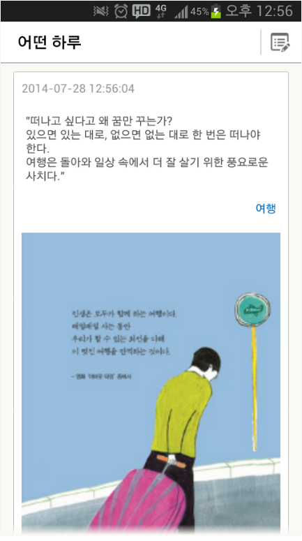

# 경력
[교보문고](http://www.kyobobook.co.kr/)
- 2016/09 ~ 현재

[유누스](http://theunus.com/ko/)
- 2013/07 ~ 2016/09

## 개인 팀 프로젝트
### My Book Story
내가 읽은 책을 쉽게 검색하고 남기고 싶은 글귀를 사진으로 찍어 저장하여 책장에 보관할 수 있는 도서 관리 서비스.
- 기간: 2014/7 ~ 2016/8
- 사용기술 : Java
- GooglePlayStore (https://play.google.com/store/apps/details?id=com.jjhkbk.bookdiary&hl=ko)

   

## 회사 프로젝트
### 헤이딜러
- 소속 : 피알앤디컴퍼니 
- 역할 : iOS 앱 개발
- 기간 : 2016/06/15 ~ 현재
- 사용기술 : iOS, Swift(3.0), RxSwift
- GooglePlayStore (https://itunes.apple.com/kr/app/id980166975)
    

### 헤이딜러(딜러용)
- 소속 : 피알앤디컴퍼니 
- 역할 : iOS 앱 개발
- 기간 : 2016/06/15 ~ 현재
- 사용기술 : iOS, Swift(3.0), Firebase, RxSwift
- GooglePlayStore (https://itunes.apple.com/kr/app/id1147518289)

    

### 카큐™중고차 시세계산기중고차들의 가격변동과 중고차의 판매가격을 예측정책적으로 핵심기능은 비활성상태
- 소속 : 피알앤디컴퍼니 
- 역할 : iOS 앱 개발
- 기간 : 2016/01/05 ~ 2016/06/07
- 사용기술 : iOS, Swift(2.3)
- GooglePlayStore (https://itunes.apple.com/kr/app/id1084930611)

### 시간표-타임스프레드시간표 관리하는 어플리케이션
- 발주: J CONNECT
- 역할 : iOS 앱 개발
- 기간 : 2016/01/14 ~ 2016/03/28
- 사용기술 : iOS, Swift(2.3), Realm
- GooglePlayStore (https://itunes.apple.com/kr/app/id457130897)
  

### 두포토사진가들이 사진을 찍고 고객들과 손쉽게 사진을 공유하고 관리하기위한 서비스
- 소속 : 마인드퀘이크
- 역할 : 서버(초기 구조 작업), 웹 개발
- 기간 : 2015/08/28 ~ 2015/10/30
- 사용기술 : AngularJS, Node.js, HTML, CSS
- Site (http://dophoto.co)

### 썸머커플끼리 사진을 찍고 공유하기가 불편하다는 포인트를 개선하기 위해서 제작한 커플사진앱
- 기간 : 2015/01/11 ~ 2015/08/28
- 소속 : 선데이벅스
- 역할 : Android, iOS, 서버
- 사용기술 : Java, Swift(2.3), GPUImage, Node.js
- 서비스종료
    

### 스프링비율이 좋지 않게 나온 전신 사진의 비율을 좋게 만들어주는 사진앱 (키늘리기, 다이어트, 얼굴 축소)
- 기간 : 2014/06/03 ~ 현재
- 소속 : 선데이벅스
- 역할 : Android, iOS, OpenGL
- 사용기술 : Java, Objective-C
    
