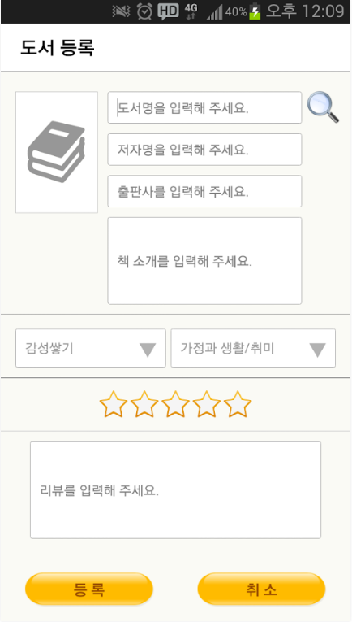
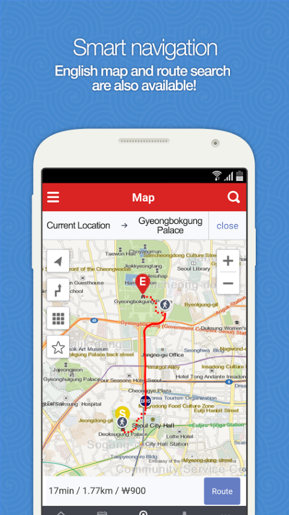

# 경력
[교보문고](http://www.kyobobook.co.kr/)
- 2016/09 ~ 현재

[유누스](http://theunus.com/ko/)
- 2013/07 ~ 2016/09

## 개인 프로젝트
### 미세멍지
미세먼지를 WHO 기준으로 제공해주며 사랑스러운 반려견과 산책하기 좋은지에 대해서 직관적으로 제공해주는 앱.
- 기간: 2019/2 ~ 2019/3
- 사용기술 : Java, retrofit, realm
- GooglePlayStore (https://play.google.com/store/apps/details?id=kr.com.misemung)

## 개인 팀 프로젝트
### My Book Story
내가 읽은 책을 쉽게 검색하고 남기고 싶은 글귀를 사진으로 찍어 저장하여 책장에 보관할 수 있는 도서 관리 서비스.
- 기간: 2014/7 ~ 2014/8
- 사용기술 : Java, SQLite
- GooglePlayStore (https://play.google.com/store/apps/details?id=com.jjhkbk.bookdiary&hl=ko)

   

## 회사 프로젝트
### 교보문고 eBook & eBook for SAMSUNG - eBook 앱
- 소속 : 교보문고 
- 역할 : 안드로이드 앱 개발
- 기간 : 2016/09 ~ 현재
- 사용기술 : Java, retrofit, DRM, TTS
- GooglePlayStore (https://play.google.com/store/apps/details?id=com.kyobo.ebook.common.b2c&hl=ko)

   

### 신규 교보문고 eBook & eBook for SAMSUNG - eBook 앱
- 역할 : 안드로이드 앱 개발
- 사용기술 : Java, retrofit, DRM, TTS

### 교보문고 전자도서관 - 교보문고와 제휴된 전자도서관의 이용자를 위한 것으로 도서 대출/반납 서비스 제공
- 소속 : 교보문고 
- 역할 : 안드로이드 앱 개발
- 기간 : 2016/09 ~ 현재
- 사용기술 : Java, DRM, TTS
- GooglePlayStore (https://play.google.com/store/apps/details?id=com.kyobo.ebook.b2b.phone.type3)

    

### 신규 교보문고 전자도서관 - 교보문고와 제휴된 전자도서관의 이용자를 위한 것으로 도서 대출/반납 서비스 제공
- 역할 : 안드로이드 앱 개발
- 사용기술 : Java, retrofit, DRM, TTS

### 웹소설 톡소다 - 유명 웹소설 작가의 작품을 구독할 수 있고 누구나 작가신청하여 집필 가능한 서비스
- 소속 : 교보문고 
- 역할 : 안드로이드 앱 개발
- 기간 : 2016/10/10 ~ 2017/04/01
- 사용기술 : Java
- GooglePlayStore (https://play.google.com/store/apps/details?id=com.kyobo.tocsoda)

    

### KT ucloud - KT의 클라우드 기반 백업 서비스
- 소속 : 유누스
- 역할 : 안드로이드 앱 개발
- 기간 : 2016/03 ~ 2016/09/23
- 사용기술 : Java
- GooglePlayStore (https://play.google.com/store/apps/details?id=com.kth.widgets.uucloud)

   

### 종근당 M-Office - 종근당 영업사원들의 실적을 기록하는 앱
- 소속 : 유누스
- 역할 : 안드로이드 앱 개발
- 기간 : 2015/12 ~ 2016/02
- 사용기술 : Java, Android, Volley

### TvingStickMnet
- 소속 : 유누스
- 역할 : 안드로이드 앱 개발
- 기간 : 2015/07 ~ 2015/11
- 사용기술 : Java, Android, Volley

### CLiP 혜택 ((구)올레앱통) -  KT제휴컨텐츠들을 하나로 모아 제공하는 서비스 앱
- 소속 : 유누스
- 역할 : 안드로이드 앱 개발
- 기간 : 2015/07 ~ 2015/11
- 사용기술 : Java, Android, Volley, KPNS
- 서비스 종료

### Visit Korea : Official Guide (영문) - 국내 여행정보포털, 숙박, 관광명소, 맛집 정보, 동영상, 사진, 이벤트 행사 안내 서비스
- 소속 : 유누스
- 역할 : 안드로이드 앱 개발
- 기간 : 2015/04 ~ 2015/07
- 사용기술 : Java, Android, Volley, FacebookSDK, WeiboSDK, Google Map API
- GooglePlayStore (https://play.google.com/store/apps/details?id=com.visitkorea.eng)

    

### 韩国自助游 (중문) - 국내 여행정보포털, 숙박, 관광명소, 맛집 정보, 동영상, 사진, 이벤트 행사 안내 서비스
- 소속 : 유누스
- 역할 : 안드로이드 앱 개발
- 기간 : 2015/04 ~ 2015/07
- 사용기술 : Java, Android, Volley, FacebookSDK, WeiboSDK, Google Map API
- GooglePlayStore (https://play.google.com/store/apps/details?id=kr.or.visitkorea.china)

    

### 韓国旅ガイド (일문) - 국내 여행정보포털, 숙박, 관광명소, 맛집 정보, 동영상, 사진, 이벤트 행사 안내 서비스
- 소속 : 유누스
- 역할 : 안드로이드 앱 개발
- 기간 : 2015/04 ~ 2015/07
- 사용기술 : Java, Android, Volley, FacebookSDK, WeiboSDK, Google Map API
- GooglePlayStore (https://play.google.com/store/apps/details?id=kto.visitkoreajp)

    

### KT뮤직 Genie 라디오 
- 소속 : 유누스
- 역할 : CMS 웹 사이트 개발(전시메타 스케쥴링), REST API 개발
- 기간 : 2014/11 ~ 2015/04
- 사용기술 : Java, Android, Spring 4.0, jquery, lambdaj, lombok, jodatime, MySql, tomcat7

### KT 올레마켓 
- 소속 : 유누스
- 역할 : 2014 앱리뉴얼 관리자 웹 사이트 개발 (기프티쇼 상품에 대한 전시제어 기능 개발, 이벤트 전시제어 기능 개발) 하이브리드 앱 인증고도화(보안번호 : 상품구매시 보안번호 적용 / 성인인증 : 성인상품구매시 성인인증 적용)
- 기간 : 2014/01 ~ 2014/11
- 사용기술 : Java, Android, Spring 2.5, Spring 3.1, quartz, jquery, Sql Server 2008, tomcat6
- 서비스 종료 (ONEstore로 통합)

