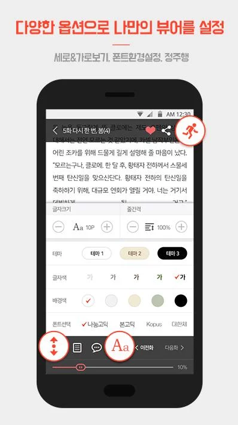

# 경력
[교보문고](http://www.kyobobook.co.kr/)
- 2016/09 ~ 현재

[유누스](http://theunus.com/ko/)
- 2013/07 ~ 2016/09

## 개인 팀 프로젝트
### My Book Story
내가 읽은 책을 쉽게 검색하고 남기고 싶은 글귀를 사진으로 찍어 저장하여 책장에 보관할 수 있는 도서 관리 서비스.
- 기간: 2014/7 ~ 2014/8
- 사용기술 : Java
- GooglePlayStore (https://play.google.com/store/apps/details?id=com.jjhkbk.bookdiary&hl=ko)

   

## 회사 프로젝트
### 교보문고 eBook
- 소속 : 교보문고 
- 역할 : 안드로이드 앱 개발
- 기간 : 2016/09 ~ 현재
- 사용기술 : Java, retrofit, DRM, TTS
- GooglePlayStore (https://play.google.com/store/apps/details?id=com.kyobo.ebook.common.b2c&hl=ko)

    

### 교보문고 전자도서관
- 소속 : 교보문고 
- 역할 : 안드로이드 앱 개발
- 기간 : 2016/09 ~ 현재
- 사용기술 : Java, DRM, TTS
- GooglePlayStore (https://play.google.com/store/apps/details?id=com.kyobo.ebook.b2b.phone.type3)

    

### 웹소설 톡소다
- 소속 : 교보문고 
- 역할 : 안드로이드 앱 개발
- 기간 : 2016/10/10 ~ 2017/04/01
- 사용기술 : Java
- GooglePlayStore (https://play.google.com/store/apps/details?id=com.kyobo.tocsoda)

    

### KT ucloud
- 소속 : 유누스
- 역할 : 안드로이드 앱 개발
- 기간 : 2016/01/14 ~ 2016/03/28
- 사용기술 : Java
- GooglePlayStore (https://play.google.com/store/apps/details?id=com.kth.widgets.uucloud)

  

### Visit Korea : Official Guide (영문)
- 소속 : 유누스
- 역할 : 안드로이드 앱 개발
- 기간 : 2015/08/28 ~ 2015/10/30
- 사용기술 : Java
- GooglePlayStore (https://play.google.com/store/apps/details?id=com.visitkorea.eng)

### 韩国自助游 (중문)
- 소속 : 유누스
- 역할 : 안드로이드 앱 개발
- 기간 : 2015/01/11 ~ 2015/08/28
- 사용기술 : Java
- GooglePlayStore (https://play.google.com/store/apps/details?id=kr.or.visitkorea.china)

    

### 韓国旅ガイド (일문)
- 소속 : 유누스
- 역할 : 안드로이드 앱 개발
- 기간 : 2014/06/03 ~ 현재
- 사용기술 : Java
- GooglePlayStore (https://play.google.com/store/apps/details?id=kto.visitkoreajp)

    
